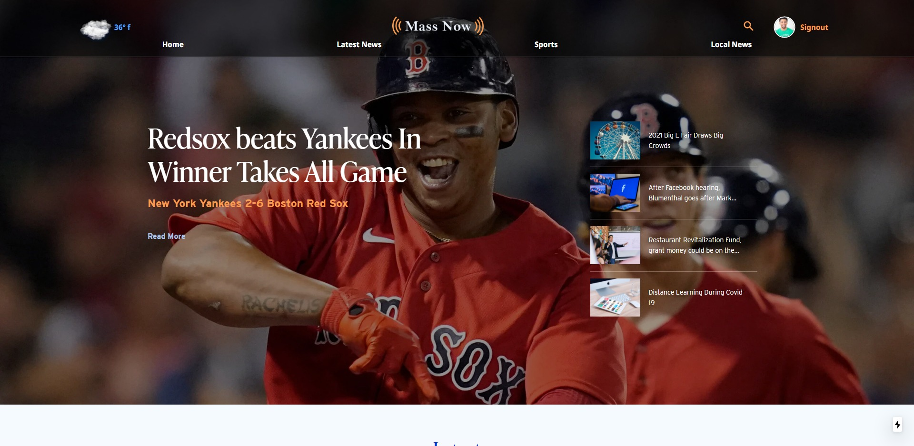

  

<!-- Tables -->
|      |         |
| -------- | -------------- |
| | |
| | |
| | |
| | |

# MassNow News Site (Frontend) - React/Next.js

This is a newly completed MERN stack project, a fictional multi user news site similar to Masslive.com. Some of the features of this project include but not limited to JWT based Authentication System, Role Based Authorization System, Role Based Authorization System, full CRUD capabilities with image uploading capabilities. 

## Getting Started

To get started clone or download the repository, this is the front repository so after you run npm install to install the necessary dependencies for the front end, you will want to make sure you have done this for the backend as well. And you will need to make sure you have the server side running before starting the front end. This project uses MongoDB for its database needs, so you can use a localized version, or signup for a free at **[Mongo Atlas](https://www.mongodb.com/ "MongoDB")** account and store your database in the cloud. 

This project also uses the Cloudinary Widget for uploading and storage of media files, so it would necessary to sign up for free account here --> **[Cloudinary](https://cloudinary.com/users/register/free/ "Cloudinary")**. When you signup you will be given a **cloudname** which is a string. You will also need an upload present which is also a string. To get this, after you sign up and log in you will be directed to the cloudinary console page. Click on the settings icon top right. Then scroll down until you see this section referenced in the picture
below.

After you obtain both you then want to look for the .env-local.sample file in the client folder. Paste both the cloudname, and upload present, then rename .env-local.sample to .env.local, then you are all set to use the Cloudinary Upload Widget.

This also uses the Openweather API to  get the current weather, so would need to sign up
and obtain an api key, then perform the same steps as with the Cloudinary Widget.

## BUILT WITH
* Node.js
* React.js
* Next.js
* Express
* MongoDB
* Cloudinary
